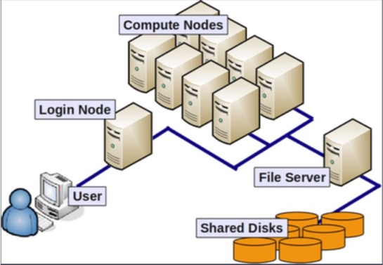
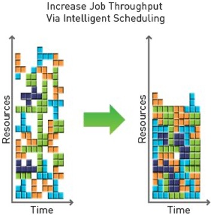
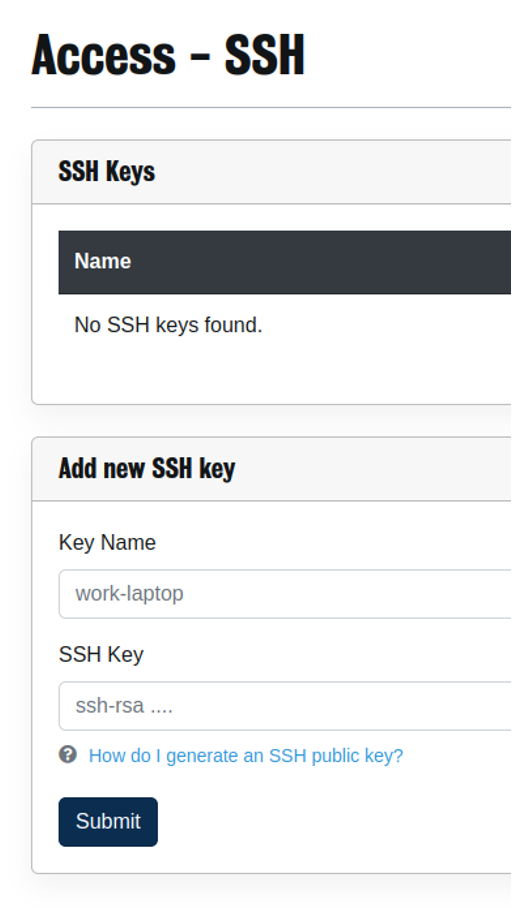
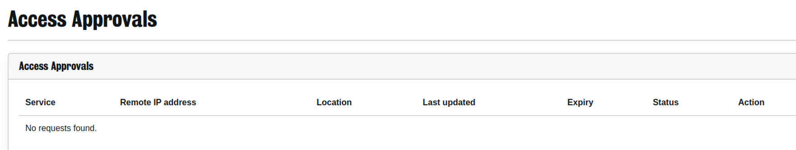
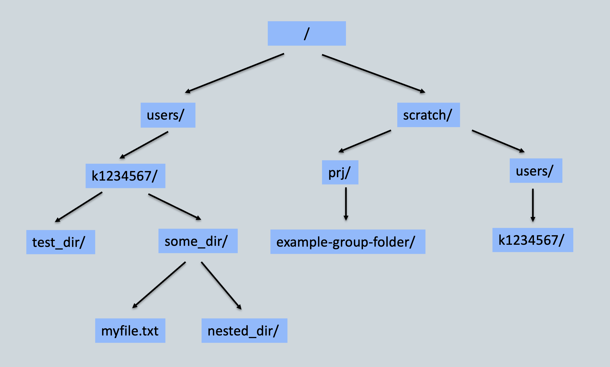
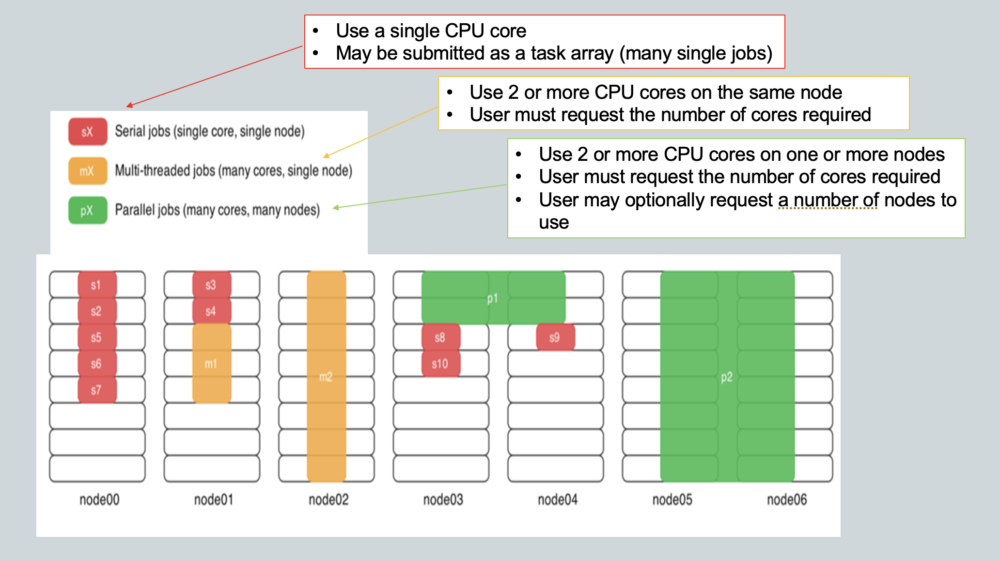

# Introduction to High Performance Computing with CREATE

---

## Welcome!

<small>

This workshop is an introduction to using the CREATE High Performance Computing (HPC) system and is intended to give a basic overview of the tools available and how to use them.

By the end of the training, you should be able to:

* Connect to CREATE HPC
* Manage your files and programs on CREATE
* Use modules to find and load the necessary software
* Submit jobs to the queue and check the results of submitted jobs

The training material and slides are available online, so you don't need to take detailed notes!

</small>

---

## Overview

* What is CREATE?
* What is a high performance computing cluster?
* Connecting to the HPC cluster
* Navigating the HPC filesystem
* Using software on CREATE HPC
* Submitting jobs to the HPC cluster

---

## About CREATE

<small>

King's Computational Research, Engineering and Technology Environment (CREATE) is a tightly integrated ecosystem of research computing infrastructure hosted by King’s College London. It consists of:

* CREATE Cloud: A private cloud platform to provide flexible and scalable hosting environments using virtual machines

* CREATE HPC: A high performance compute cluster with CPU and GPU nodes, fast network interconnects and shared storage, for large scale simulations and data analytics

* CREATE RDS: A very large, highly resilient storage area for longer term curation of research data

* CREATE TRE: Tightly controlled project areas making use of Cloud and HPC resources to process sensitive datasets (e.g. clinical PII)

* CREATE Web: A self-service web hosting platform for static content (HTML/CSS/JS) and WordPress sites

</small>

---

## What is a High Perfomance Computing (HPC) cluster?

<small>A clustered network of computers used to tackle large scale analytical problems.</small>



---

## What is a compute node?

* CPU: Central Processing Unit
* Core: individual processor


---

## Allocating resources

<small>
The cluster uses a job scheduler that is designed to support different types of workloads, making use of all available compute resources with as much efficiency as possible.
</small>



---

## Connecting to CREATE HPC

---

## SSH keys

* SSH keys are used to authenticate users
* Create an SSH key pair: `ssh-keygen –t rsa`
* Private key proves your identity - do not share this!
* Public key is for authorization

* MacOS and Linux devices: `~/.ssh/id_rsa.pub`
* Windows devices: `C:\Users\k1234567\.ssh\id_rsa.pub`

---

## Adding your public key to the e-Research portal

* Go to https://portal.er.kcl.ac.uk/access/ssh



---

## Connecting via SSH

<small>

* Use `ssh` to connect to the HPC login node
* MacOS/Linux users: `ssh k1234567@hpc.create.kcl.ac.uk`
* Windows users: `ssh –m hmac-sha2-512 k1234567@hpc.create.kcl.ac.uk`
* You will be asked to confirm the fingerprint if this is the first time connecting
* Approve your multifactor authentication request:  https://portal.er.kcl.ac.uk/mfa

</small>



---

## Understanding the HPC filesystem

<small>

* Every user has their own personal storage areas in the following locations:
    * Personal home directory: `/users/k1234567`
    * Personal scratch directory: `/scratch/users/k1234567`

* Where you are a member, additional shared group locations are available for use:
    * Shared project directories, for example: `/scratch/prj/my_lab_project`
    * Dataset groups, for example: `/datasets/hpc_training/`

</small>

---

## Where am I?

Your personal home directory is the default landing location when you first log into the HPC. The print working directory (`pwd`) command will display your current location in the terminal:

```bash
k1234567@erc-hpc-login2:~$ pwd
/users/k1234567
```

---

## Useful commands

<small>

* Listing directory contents:
`ls -l --all`

* Creating an empty file:
`touch example-file.txt`

* Creating a new empty directory:
`mkdir example-folder`

* Change working directory location:
`cd example-folder`

* Show current folder location:
`pwd`

</small>

---

## Useful commands for working with files

<small>

* Creating and writing to a file:
`nano hello-world.txt`

* Reading a file:
`less hello-world.txt`

* Copying a file:
`cp hello-world.txt my-copy.txt`

* Moving a file:
`mv hello-world.txt example-folder`

* Remove a file:
`rm my-copy.txt`

</small>

---

## Directory structure



<small>

`/users/k1234567/some_dir/myfile.txt`

`/scratch/prj/example-group-folder/`

</small>

---

## Using software on CREATE HPC

---

## Available software

Centrally managed software can be found through environment modules.

* Find software using:
    * `module avail <package-name>`

* For additional information on a module:
    * `module spider <package-name>`
    * `module whatis <package-name>`

---

## Using software modules

* Loading a module: `module load <package-name>`
* Loading a module also dynamically loads required environment variables and paths to executables
* Listing currently loaded software modules: `module list`
* Unloading a module: `module rm <package-name>`

---

## Submitting jobs on CREATE HPC

---

## Job types



---

## Next steps

* Fill in the training feedback survey!
* Request continued access to CREATE HPC
    * Consider requesting an RDS project - this gives up to 5TB backed-up storage
* Check the documentation: https://docs.er.kcl.ac.uk/
* Check out the user forum: https://forum.er.kcl.ac.uk/
